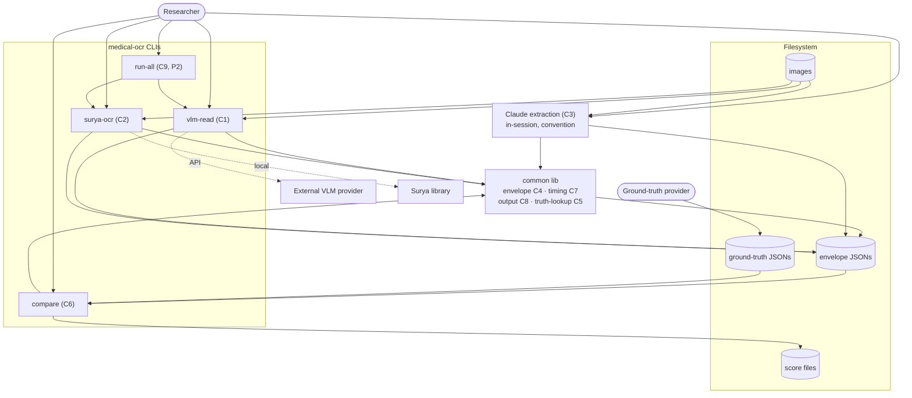

# Architecture Overview — medical-ocr

> Produced by `/architecture`. Curated, not exhaustive. Traces to the capability
> map (Gate 1) and the use cases in `../discovery/use-cases.md`. This is an R&D
> evaluation harness — velocity and comparability over production polish.

## Capability → component map

| Capability | Serves (UC) | Component |
|---|---|---|
| C1 VLM extraction | UC-001 | `vlm-read` CLI |
| C2 Surya OCR extraction | UC-002 | `surya-ocr` CLI |
| C3 Claude extraction | UC-003 | Claude convention (prompt + envelope) — or the `claude-extract` script (ADR-0005) |
| C4 Shared extraction envelope | UC-001/002/003/006 | `common` (shared lib) |
| C5 Ground-truth association | UC-004/005 | `common` (shared lib) + filesystem |
| C6 Scoring / comparison | UC-005 | `compare` CLI |
| C7 Duration measurement | UC-001/002/006 | `common` (shared lib) |
| C8 Output file writing | UC-001/002/003/005/006 | `common` (shared lib) |
| C9 Multi-backend orchestration | UC-006 | `run-all` orchestrator |

**Coverage:** every use case is served by ≥1 capability/component; nothing floats.

## Components

- **`common`** — shared Python module: the extraction-envelope schema (C4),
  duration timing helper (C7), output-file writer + path convention (C8), and
  ground-truth locate/validate helpers (C5). Every other component depends on it.
  This is the contract that makes backends comparable.
- **`vlm-read` CLI** — `vlm-read file.jpg model-name` (C1). Sends the image to a
  named VLM, times it, writes an envelope JSON.
- **`surya-ocr` CLI** — `surya-ocr file.jpg` (C2). Runs Surya, times it, writes
  an envelope JSON.
- **Claude convention / `claude-extract`** (C3). Two ways to run the same backend:
  (a) the **convention** — a documented prompt + the envelope shape; Claude reads
  the image in-session and the answer is saved to the same output location the CLIs
  use (via `claude-envelope`); and (b) the **`claude-extract` script** (ADR-0005),
  which automates that over headless `claude -p` for a one-command run. C3 was
  originally "no script"; ADR-0005 reverses that, taking a dependency on the
  `claude` CLI (+ per-run cost) for reproducibility. The convention remains the
  fallback and the single source of the prompt/envelope shape.
- **`compare` CLI** — `compare <backend.json…> --truth <truth.json>` (C6). Loads
  backend envelope(s) + ground truth, computes field-level accuracy with
  exact-match per field, writes a score file.
- **`run-all` orchestrator** — one command over one image that invokes the
  available backends (C9). Deferred (P2).
- **Filesystem (data store)** — images, output envelope JSONs, hand-authored
  ground-truth JSONs, and score files all live as plain files.

## Container diagram (C4-ish)

## Boundaries & notes

- **Everything is file-in / file-out.** No web UI, no DB, no batch, no service
  (per concept non-goals). The filesystem is the only store.
- **`common` is the seam.** The envelope schema is the single contract; adding a
  new backend later means "produce an envelope JSON," nothing more.
- **Claude backend — convention *or* `claude-extract`.** Either way it writes the
  same envelope shape to the same output location, so `compare` treats it
  identically. Originally "no script" (C3); ADR-0005 adds the optional
  `claude-extract` script over headless `claude -p` for a one-command run.
- **External dependencies:** `vlm-read` calls an external VLM provider (API);
  `surya-ocr` uses the local Surya library; **`claude-extract` shells out to the
  `claude` CLI** (Claude Code, authenticated; billable per run — opt-in, ADR-0005).
  These are the contested-stack points handled in the ADRs.

## Open questions (resolved in ADRs / backlog)

- Envelope JSON schema specifics → ADR-0002.
- VLM invocation approach (which provider/SDK, config) → ADR-0001.
- Ground-truth file naming convention → ADR-0003.
- Scoring definition for nested/text fields → ADR-0004.
